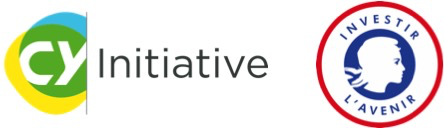
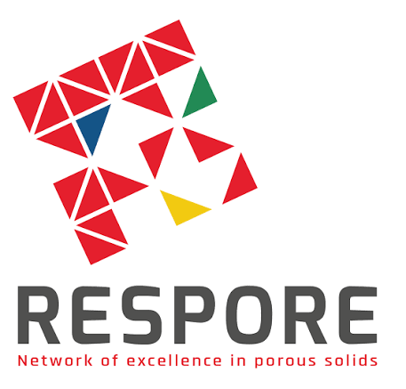
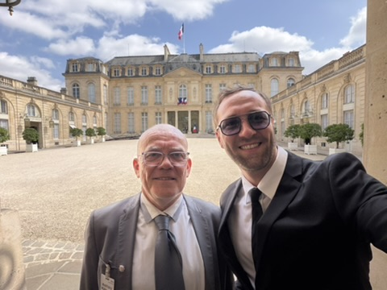

```{=html}
<div class="funding-v40-page">
<section class="v12-page-hero funding-v40-hero">
  <div class="v12-section-label">RESEARCH ECOSYSTEM</div>
  <h1>Funding, collaborations and innovation</h1>
  <p>My research programme is developed within LAMBE and supported through competitive projects, national research programmes, regional initiatives and translational collaborations.</p>
</section>

<section class="v12-section">
  <div class="v12-heading-row"><div><div class="v12-section-label">PROJECT LEADERSHIP</div><h2>Projects led as Principal Investigator</h2></div></div>
  <div class="v12-funding-grid funding-v40-grid">
    <article class="funding-v40-card funding-v40-card-primary">
      <span>ANR JCJC · 2023–2027</span>
      <h3>QuaBioNHy</h3>
      <p><strong>ANR-23-CE44-0013</strong></p>
      <p>Competitive national funding supporting the development of nanopore approaches for the identification and quantification of peptide biomarkers.</p>
      <div class="funding-v40-role">Principal Investigator</div>
    </article>
    <article class="funding-v40-card funding-v40-card-primary">
      <div class="funding-v60-logo-row"><span>CY INITIATIVE · EMERGENCE · 2021–2024</span></div>
      <h3>Low-copy biomarker identification by nanopores</h3>
      <p>A single-molecule and single-cell approach developed within LAMBE – Biology.</p>
      <div class="funding-v40-role">Principal Investigator</div>
    </article>
    <article class="funding-v40-card funding-v40-card-primary">
      <div class="funding-v60-logo-row"><span>CY INITIATIVE · GÉNÉRATIONS PNADS · 2025–2030</span></div>
      <h3>Molecular information storage by nanopores</h3>
      <p>Leadership of a strategic programme focused on reading and decoding molecular information encoded in sequence-defined polymers using biological nanopores at the single-molecule level.</p>
      <div class="funding-v40-role">Project Leader</div>
    </article>
  </div>
</section>

<section class="v12-section funding-v40-soft">
  <div class="v12-heading-row"><div><div class="v12-section-label">COLLABORATIVE PROGRAMMES</div><h2>Participation in national and strategic programmes</h2></div></div>
  <div class="funding-v40-programmes">
    <article><div><span>PARTICIPANT</span><h3>PEPR MolecularXiv</h3><p>Sequence-defined and digital polymers, with a focus on their electrical discrimination and future single-molecule decoding.</p></div></article>
    <article><div><span>PARTICIPANT</span><h3>PEPR SENSIGA</h3><p>Nanopore approaches applied to molecular species and sensing questions relevant to energy materials.</p></div></article>
    <article><div><span>COLLABORATIVE ECOSYSTEM</span><h3>IHU PROMETHEUS</h3><p>Biomarker-oriented research at the interface of single-molecule analysis and translational medicine.</p></div></article>
  </div>
</section>

<section class="v12-section">
  <div class="v12-heading-row"><div><div class="v12-section-label">REGIONAL &amp; UNIVERSITY SUPPORT</div><h2>Building an independent research programme</h2></div></div>
  <div class="v12-pillar-grid v12-three">
    <article class="v12-pillar funding-v60-pillar-logo"><h3>DIM RESPore</h3><p>Regional support for nanopore research and its applications in biological analysis.</p></article>
    <article class="v12-pillar funding-v60-pillar-logo"><h3>CY Initiative – Emergence</h3><p><strong>2021–2024</strong> · Support for the project on low-copy biomarker identification at the single-molecule and single-cell levels.</p></article>
    <article class="v12-pillar funding-v60-pillar-logo"><h3>CY Initiative – Générations PNADS</h3><p><strong>2025–2030</strong> · A major programme led by Benjamin Cressiot on molecular information storage, with biological nanopores used to read and decode information encoded in sequence-defined polymers.</p></article>
  </div>
</section>

<section class="v12-section funding-v40-innovation">
  <div class="funding-v40-photo">
    
  </div>
  <div class="funding-v40-copy">
    <div class="v12-section-label">INNOVATION &amp; TECHNOLOGY TRANSFER</div>
    <h2>Discussing the future of DreamPore at the Élysée</h2>
    <p>On 23 July 2026, Benjamin Cressiot and Pierre Defrenaix, from Excilone, met at the Palais de l’Élysée to discuss the future of <strong>DreamPore</strong>, a startup hosted at CY Cergy Paris Université in which Benjamin Cressiot also contributes scientifically.</p>
    <p>The discussion focused on nanopore-based biomarker diagnostics, technology transfer and the development of French technological sovereignty in molecular analysis.</p>
    <div class="funding-v40-caption">Benjamin Cressiot and Pierre Defrenaix (Excilone), Palais de l’Élysée, July 2026.</div>
  </div>
</section>

<section class="v12-section v12-closing">
  <div><div class="v12-section-label">COLLABORATE</div><h2>From fundamental nanopore science to useful molecular technologies</h2><p>Potential collaborations are especially relevant in peptide and protein analysis, disease biomarkers, digital polymers, molecular modelling and energy materials.</p></div>
  <div class="v12-actions"><a class="btn btn-primary" href="contact.qmd">Contact</a></div>
</section>
</div>
```
