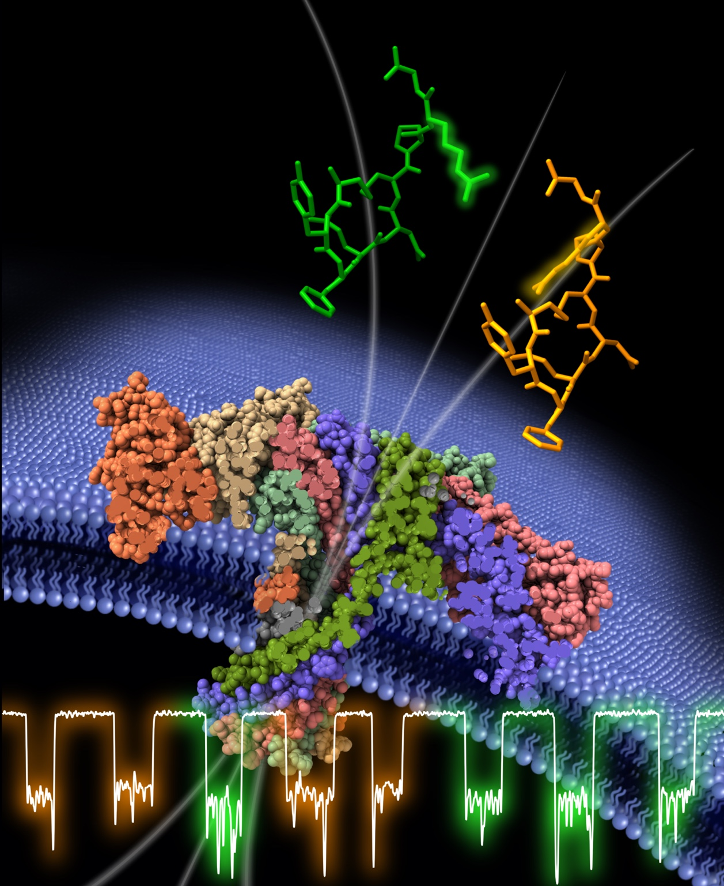
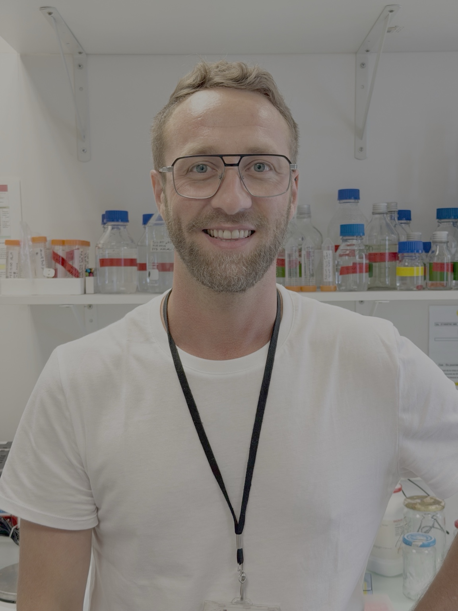
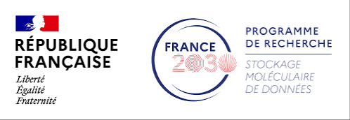
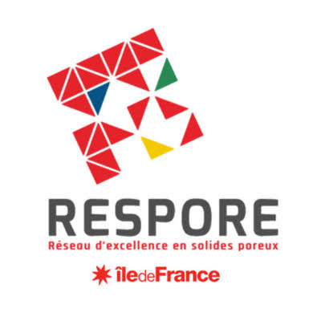
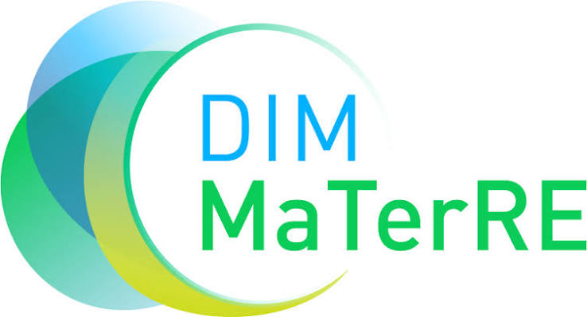

```{=html}
<section class="v21-institutions" aria-label="Institutional affiliations">
  <div class="v21-inst-item"></div>
  <span class="v21-inst-divider" aria-hidden="true"></span>
  <div class="v21-inst-item v21-lambe">LAMBE</div>
  <span class="v21-inst-divider" aria-hidden="true"></span>
  <div class="v21-inst-item"></div>
</section>

<section class="v21-hero">
  <div class="v21-hero-copy">
    <div class="v21-kicker">BENJAMIN CRESSIOT · LAMBE · CNRS UMR 8587</div>
    <h1>Reading Molecular <em>Information</em><br>One Molecule<br>at a Time</h1>
    <p class="v21-role">Associate Professor of Biochemistry and Molecular Biology · HDR</p>
    <p>I develop biological and solid-state nanopores to detect and identify proteins and peptide biomarkers, unravel their conformations and post-translational modifications, and discriminate isomeric variants at the single-molecule level.</p>
    <div class="v21-actions">
      <a class="v21-btn primary" href="research.qmd"><i class="bi bi-rocket-takeoff" aria-hidden="true"></i> Discover my research <span>→</span></a>
      <a class="v21-btn secondary" href="publications.qmd"><i class="bi bi-file-earmark-text" aria-hidden="true"></i> View publications <span>→</span></a>
    </div>
  </div>
  <div class="v21-hero-art">
    
    <div class="v21-cover-label">Featured on the cover of <strong>ACS Central Science (2024)</strong></div>
  </div>
</section>

<section class="v21-stats">
  <div class="v21-stat"><i class="bi bi-file-earmark-text" aria-hidden="true"></i><div><strong>26</strong><span>Peer-reviewed articles<br>2011–2026</span></div></div>
  <div class="v21-stat"><i class="bi bi-quote" aria-hidden="true"></i><div><strong>1,719</strong><span>Citations<br>Google Scholar ↗</span></div></div>
  <div class="v21-stat"><i class="bi bi-person" aria-hidden="true"></i><div><strong>7</strong><span>Corresponding-author<br>publications</span></div></div>
  <div class="v21-stat"><i class="bi bi-globe2" aria-hidden="true"></i><div><strong>International</strong><span>collaborations<br>Europe · Asia · USA<br>Canada · Australia</span></div></div>
  <div class="v21-stat"><i class="bi bi-beaker" aria-hidden="true"></i><div><strong>Research focus</strong><span>Nanopore sensing<br>Biomarkers · PTMs<br>Conformation · Isomers</span></div></div>
  <div class="v21-stat profiles"><span>View my profiles</span><a href="https://scholar.google.com/citations?user=j6joo1gAAAAJ&amp;hl=en">Google Scholar ↗</a><a class="orcid" href="https://orcid.org/0000-0001-9319-3152">ORCID ↗</a></div>
</section>

<section class="v34-profile" aria-label="About Benjamin Cressiot">
  <div class="v34-profile-photo"></div>
  <div class="v34-profile-copy">
    <span>ABOUT</span>
    <h2>Single-molecule nanopore science for molecular diagnostics</h2>
    <p>At LAMBE, I develop nanopore approaches that connect molecular structure to electrical signatures, with applications ranging from peptide and protein biomarkers to informational polymers and reactive battery species.</p>
    <a href="cv.qmd">View academic profile →</a>
  </div>
</section>

<section class="v21-horizons">
<div class="v21-section-head"><div><span>RESEARCH SNAPSHOT</span><h2>Four complementary research directions</h2></div><a href="research.qmd">Explore research →</a></div>
<div class="v21-card-grid">
<article class="v21-theme-card"><div class="v21-card-copy"><h3>Biological nanopores</h3><p>Engineering aerolysin to decode proteins, peptides and molecular information.</p></div></article>
<article class="v21-theme-card"><div class="v21-card-copy"><h3>Solid-state nanopores</h3><p>Transport physics and sensing in complex biological media.</p></div></article>
<article class="v21-theme-card"><div class="v21-card-copy"><h3>Disease biomarkers</h3><p>Single-molecule detection of clinically relevant peptide biomarkers.</p></div></article>
<article class="v21-theme-card"><div class="v21-card-copy"><h3>Emerging applications</h3><p>Digital polymers and lithium–sulfur battery chemistry.</p></div></article>
</div></section>

<section class="v25-logo-strip" aria-label="Research programmes and networks">
  <a href="https://anr.fr/" aria-label="Agence nationale de la recherche — ANR"></a>
  <a href="https://pepr-molecularxiv.fr/" aria-label="PEPR MoleculArXiv"></a>
  <div aria-label="PEPR Batteries"></div>
  <div aria-label="IHU PROMETHEUS — Comprehensive Sepsis Center"></div>
  <a href="https://www.respore.fr/" aria-label="DIM RESPORE"></a>
  <a href="https://www.dim-materre.fr/" aria-label="DIM MaTerRE"></a>
</section>
```
