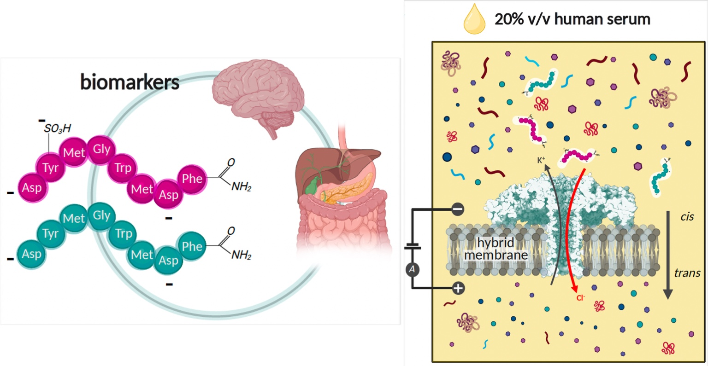
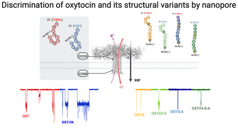
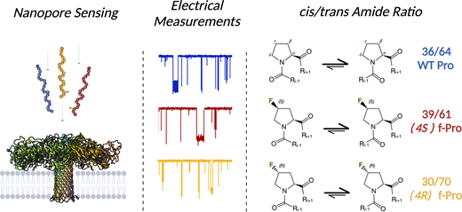
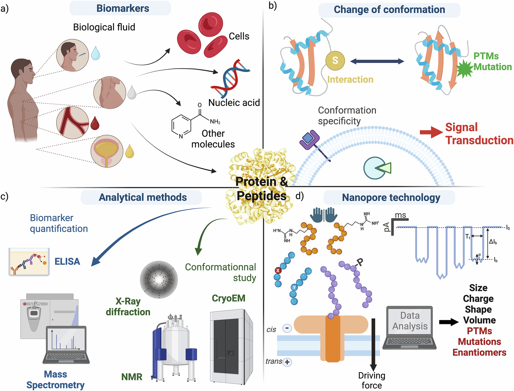
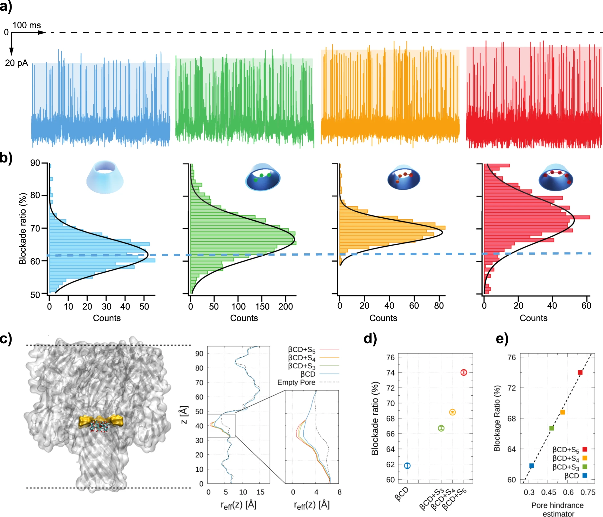

<section class="cv-hero publications-hero-v15">

PUBLICATIONS

# Selected work & complete record

Selected research landmarks and a complete peer-reviewed record spanning biological and solid-state nanopores, molecular recognition, disease biomarkers and emerging applications.

<strong>26</strong>Peer-reviewed articles

<strong>1,719</strong>Google Scholar citations

<strong>19</strong>h-index

<strong>20</strong>i10-index

</section>
<section class="cv-section pub-featured-v15">

SELECTED PUBLICATIONS

## Research landmarks

Six papers that capture the progression from nanopore transport and molecular recognition to biomarker analysis in complex samples.

<article class="pub-premium-card-v32 pub-landmark-lead-v47 reveal">
  

  

Small2026
<h3>Discrimination of Sulfated and Unsulfated Gut-Hormone Biomarkers in Human Serum</h3>
Identification of CCK-8 and SO₃-CCK-8 in a complex human-serum matrix using three complementary nanopore parameters.

Human serumPTMs
<a class="pub-premium-link-v32" href="https://doi.org/10.1002/smll.74968">View publication →</a>

</article>
<article class="pub-premium-card-v32 reveal">
  

  

ACS Nano2025
<h3>Discrimination of Oxytocin and Its Structural Variants by Nanopore</h3>
Structural-variant sensing of a behaviour-related neuropeptide through complementary single-molecule electrical signatures.

NeuropeptidesStructural variants
<a class="pub-premium-link-v32" href="https://doi.org/10.1021/acsnano.5c08031">View publication →</a>

</article>
<article class="pub-premium-card-v32 reveal">
  

  

Chemical Science2025
<h3>Single-Molecule Nanopore Sensing of Proline cis/trans Amide Isomers</h3>
Direct electrical resolution of conformational isomers generated by proline peptide-bond isomerisation.

ConformationIsomers
<a class="pub-premium-link-v32" href="https://doi.org/10.1039/D5SC01156F">View publication →</a>

</article>
<article class="pub-premium-card-v32 reveal">
  

  

Nature Communications2025
<h3>Nanopore Sensing of Protein and Peptide Conformation for Point-of-Care Applications</h3>
A perspective defining the translational potential of nanopore conformational sensing for future diagnostics.

PerspectiveDiagnostics
<a class="pub-premium-link-v32" href="https://doi.org/10.1038/s41467-025-58509-8">View publication →</a>

</article>
<article class="pub-premium-card-v32 pub-premium-cover reveal">
  

  

ACS Central Science2024
<h3>Identification and Detection of a Peptide Biomarker and Its Enantiomer by Nanopore</h3>
Single-molecule discrimination of chirality in a medically relevant peptide biomarker, featured on the journal cover.

ChiralityBiomarkersAerolysin
<a class="pub-premium-link-v32" href="https://doi.org/10.1021/acscentsci.4c00020">View publication →</a>

</article>
<article class="pub-premium-card-v32 reveal">
  

  

Communications Materials2020
<h3>Single-Sulfur Atom Discrimination of Polysulfides with a Protein Nanopore</h3>
Single-atom resolution applied to molecular species central to lithium–sulfur battery chemistry.

Single-atom sensingEnergy
<a class="pub-premium-link-v32" href="https://doi.org/10.1038/s43246-020-00056-4">View publication →</a>

</article>

</section>
<section class="cv-section pub-themes-v47">

RESEARCH THEMES

## A publication record organised around four questions

<a href="research.qmd" class="pub-theme-card-v47">01
<h3>How can biological nanopores become molecular readers?</h3>
Aerolysin engineering, transport physics and electrical fingerprints.

</a>
<a href="research.qmd" class="pub-theme-card-v47">02
<h3>How can solid-state nanopores analyse complex media?</h3>
Polymer-assisted transport, confinement and robust sensing conditions.

</a>
<a href="research.qmd" class="pub-theme-card-v47">03
<h3>Can closely related disease biomarkers be resolved directly?</h3>
Peptide variants, conformers, stereoisomers and post-translational modifications.

</a>
<a href="research.qmd" class="pub-theme-card-v47">04
<h3>Where else can single-molecule nanopore sensing contribute?</h3>
Digital polymers, battery chemistry and emerging molecular information systems.

</a>

</section>
<section class="cv-section pub-complete-v15">

COMPLETE RECORD

## Peer-reviewed journal articles

<a href="https://scholar.google.com/citations?user=j6joo1gAAAAJ&amp;hl=en">Google Scholar</a><a href="https://orcid.org/0000-0001-9319-3152">ORCID</a>

<strong>B. Cressiot</strong> is highlighted in each author list; * denotes corresponding authorship.

<button class="pub-filter is-active" data-filter="all">All publications</button>
<button class="pub-filter" data-filter="2023-2026">2023–2026</button>
<button class="pub-filter" data-filter="2019-2022">2019–2022</button>
<button class="pub-filter" data-filter="2011-2018">2011–2018</button>

2026<strong>2 publications</strong>

<article>26
<h3>Identification and Discrimination of Sulfated and Unsulfated Gut-Hormone Biomarkers in Human Serum by Nanopore</h3>
L. Iesu, L. Bacri, J. Pelta* and <strong>B. Cressiot*</strong>

Small · 2026 · <a class="doi-link" href="https://doi.org/10.1002/smll.74968">DOI: 10.1002/smll.74968</a>

</article>
<article>25
<h3>Scaling laws in confined media applied for biomarker detection</h3>
Y. Cai, <strong>B. Cressiot</strong>, M. Winterhalter, S. Balme, J. Pelta* and L. Bacri*

Nature Communications · 2026 · <a class="doi-link" href="https://doi.org/10.1038/s41467-026-68912-4">DOI: 10.1038/s41467-026-68912-4</a>

</article>

2025<strong>4 publications</strong>

<article>24
<h3>DNA aggregation and resolubilization in the presence of polyamines probed at the single molecule level using nanopores</h3>
Y. Cai, <strong>B. Cressiot</strong>, S. Balme, E. Raspaud, L. Bacri* and J. Pelta*

Chemical Science · 2025 · <a class="doi-link" href="https://doi.org/10.1039/D5SC05267J">DOI: 10.1039/D5SC05267J</a>

</article>
<article>23
<h3>Discrimination of oxytocin, a behavioral neuropeptide hormone, and its structural variants by nanopore</h3>
N. Meyer, L. Ratinho, S. Greive, L. Bacri, B. Morozzo della Rocca, M. Chinappi, J. Pelta* and <strong>B. Cressiot*</strong>

ACS Nano · 2025 · <a class="doi-link" href="https://doi.org/10.1021/acsnano.5c08031">DOI: 10.1021/acsnano.5c08031</a>

</article>
<article>22
<h3>Single-molecule nanopore sensing of proline cis/trans amide isomers</h3>
L. Iesu, M. Sai, V. Torbeev, B. Kieffer*, J. Pelta* and <strong>B. Cressiot*</strong>

Chemical Science · 2025 · <a class="doi-link" href="https://doi.org/10.1039/D5SC01156F">DOI: 10.1039/D5SC01156F</a>

</article>
<article>21
<h3>Nanopore sensing of protein and peptide conformation for point-of-care applications</h3>
L. Ratinho, N. Meyer, S. Greive, <strong>B. Cressiot*</strong> and J. Pelta*

Nature Communications · 2025 · <a class="doi-link" href="https://doi.org/10.1038/s41467-025-58509-8">DOI: 10.1038/s41467-025-58509-8</a>

</article>

2024<strong>1 publication</strong>

<article>20
<h3>Identification and Detection of a Peptide Biomarker and Its Enantiomer by Nanopore</h3>
L. Ratinho, L. Bacri, B. Thiebot*, <strong>B. Cressiot*</strong> and J. Pelta*

ACS Central Science · 2024 · <a class="doi-link" href="https://doi.org/10.1021/acscentsci.4c00020">DOI: 10.1021/acscentsci.4c00020</a>

</article>

2023<strong>3 publications</strong>

<article>19
<h3>Identification of Conformational Variants for Bradykinin Biomarker Peptides from a Biofluid Using a Nanopore and Machine Learning</h3>
S. Greive, L. Bacri, <strong>B. Cressiot*</strong> and J. Pelta*

ACS Nano · 2023 · <a class="doi-link" href="https://doi.org/10.1021/acsnano.3c08433">DOI: 10.1021/acsnano.3c08433</a>

</article>
<article>18
<h3>Nanopore discrimination of coagulation biomarker derivatives and characterization of a post-translational modification</h3>
A. Stierlen, S. Greive, L. Bacri, P. Manivet, <strong>B. Cressiot*</strong> and J. Pelta*

ACS Central Science · 2023 · <a class="doi-link" href="https://doi.org/10.1021/acscentsci.2c01256">DOI: 10.1021/acscentsci.2c01256</a>

</article>
<article>17
<h3>Circulating Tumor Cells in Cancer Diagnostics and Prognostics by Single-Molecule and Single-Cell Characterization</h3>
T. Chowdhury, <strong>B. Cressiot</strong>, C. Parisi, G. Smolyakov, B. Thiebot, L. Trichet, F. M. Fernandes, J. Pelta and P. Manivet

ACS Sensors · 2023 · <a class="doi-link" href="https://doi.org/10.1021/acssensors.2c02308">DOI: 10.1021/acssensors.2c02308</a>

</article>

2022<strong>3 publications</strong>

<article>16
<h3>Dynamics of DNA Through Solid-State Nanopores Fabricated by Controlled Dielectric Breakdown</h3>
I. Tanimoto, J. Zhang, <strong>B. Cressiot</strong>, B. Le Pioufle, L. Bacri and J. Pelta

Chemistry – An Asian Journal · 2022 · <a class="doi-link" href="https://doi.org/10.1002/asia.202200888">DOI: 10.1002/asia.202200888</a>

</article>
<article>15
<h3>Focus on using nanopore technology for societal health, environmental, and energy challenges</h3>
I. Tanimoto, <strong>B. Cressiot</strong>, S. Greive, B. Le Pioufle, L. Bacri and J. Pelta

Nano Research · 2022 · <a class="doi-link" href="https://doi.org/10.1007/s12274-022-4379-2">DOI: 10.1007/s12274-022-4379-2</a>

</article>
<article>14
<h3>Fast Decoding of the First Steps of Protein Aggregation Using a Nanopipette</h3>
<strong>B. Cressiot</strong> and J. Pelta

ACS Central Science · 2022 · <a class="doi-link" href="https://doi.org/10.1021/acscentsci.2c00267">DOI: 10.1021/acscentsci.2c00267</a>

</article>

2021<strong>1 publication</strong>

<article>13
<h3>Selective target protein detection using a decorated nanopore into a microfluidic device</h3>
I. Tanimoto, <strong>B. Cressiot</strong>, N. Jarroux, J. Roman, G. Patriarche, B. Le Pioufle, J. Pelta and L. Bacri

Biosensors and Bioelectronics · 2021 · <a class="doi-link" href="https://doi.org/10.1016/j.bios.2021.113195">DOI: 10.1016/j.bios.2021.113195</a>

</article>

2020<strong>2 publications</strong>

<article>12
<h3>The promise of nanopore technology: Advances in the discrimination of protein sequences and chemical modifications</h3>
<strong>B. Cressiot</strong>, L. Bacri and J. Pelta

Small Methods · 2020 · <a class="doi-link" href="https://doi.org/10.1002/smtd.202000090">DOI: 10.1002/smtd.202000090</a>

</article>
<article>11
<h3>Single-sulfur atom discrimination of polysulfides with a protein nanopore for improved batteries</h3>
F. Bétermier, <strong>B. Cressiot</strong>, G. Di Muccio, N. Jarroux, L. Bacri, B. Morozzo della Rocca, M. Chinappi, J. Pelta and J.-M. Tarascon

Communications Materials · 2020 · <a class="doi-link" href="https://doi.org/10.1038/s43246-020-00056-4">DOI: 10.1038/s43246-020-00056-4</a>

</article>

2019<strong>1 publication</strong>

<article>10
<h3>Aerolysin, a powerful protein sensor for fundamental studies and development of upcoming applications</h3>
<strong>B. Cressiot</strong>, H. Ouldali, M. Pastoriza-Gallego, L. Bacri, G. van der Goot and J. Pelta

ACS Sensors · 2019 · <a class="doi-link" href="https://doi.org/10.1021/acssensors.8b01636">DOI: 10.1021/acssensors.8b01636</a>

</article>

2018<strong>2 publications</strong>

<article>9
<h3>Thermostable virus portal proteins as reprogrammable adapters for solid-state nanopore sensors</h3>
<strong>B. Cressiot</strong>, S. Greive, M. Mojtabavi, A. Antson and M. Wanunu

Nature Communications · 2018 · <a class="doi-link" href="https://doi.org/10.1038/s41467-018-07116-x">DOI: 10.1038/s41467-018-07116-x</a>

</article>
<article>8
<h3>Differential enzyme flexibility probed using solid-state nanopores</h3>
R. Hu, J. Rodrigues, P. Waduge, H. Yamazaki, <strong>B. Cressiot</strong>, Y. Chishti, L. Makowski, D. Yu, E. Shakhnovich, Q. Zhao and M. Wanunu

ACS Nano · 2018 · <a class="doi-link" href="https://doi.org/10.1021/acsnano.8b00734">DOI: 10.1021/acsnano.8b00734</a>

</article>

2017<strong>2 publications</strong>

<article>7
<h3>Porphyrin-assisted docking of a thermophage portal protein into lipid bilayers: nanopore engineering and characterization</h3>
<strong>B. Cressiot</strong>, S. Greive, W. Si, T. Pascoa, M. Mojtabavi, M. Chechik, H. Jenkins, X. Lu, K. Zhang, A. Aksimentiev, A. Antson and M. Wanunu

ACS Nano · 2017 · <a class="doi-link" href="https://doi.org/10.1021/acsnano.7b06980">DOI: 10.1021/acsnano.7b06980</a>

</article>
<article>6
<h3>Nanopore-based measurements of protein size, fluctuations, and conformational changes</h3>
P. Waduge, R. Hu, P. Bandarkar, H. Yamazaki, <strong>B. Cressiot</strong>, Q. Zhao, P. Whitford and M. Wanunu

ACS Nano · 2017 · <a class="doi-link" href="https://doi.org/10.1021/acsnano.7b01212">DOI: 10.1021/acsnano.7b01212</a>

</article>

2015<strong>1 publication</strong>

<article>5
<h3>Dynamics and energy contributions for transport of unfolded pertactin through a protein nanopore</h3>
<strong>B. Cressiot</strong>, E. Braselmann, A. Oukhaled, A. Elcock, J. Pelta and P. L. Clark

ACS Nano · 2015 · <a class="doi-link" href="https://doi.org/10.1021/acsnano.5b03053">DOI: 10.1021/acsnano.5b03053</a>

</article>

2014<strong>1 publication</strong>

<article>4
<h3>Focus on protein unfolding through nanopores</h3>
<strong>B. Cressiot</strong>, A. Oukhaled, L. Bacri and J. Pelta

BioNanoScience · 2014 · <a class="doi-link" href="https://doi.org/10.1007/s12668-014-0128-7">DOI: 10.1007/s12668-014-0128-7</a>

</article>

2012<strong>2 publications</strong>

<article>3
<h3>Protein transport through a narrow solid-state nanopore at high voltage: experiments and theory</h3>
<strong>B. Cressiot</strong>, A. Oukhaled, G. Patriarche, M. Pastoriza-Gallego, J.-M. Betton, L. Auvray, M. Muthukumar, L. Bacri and J. Pelta

ACS Nano · 2012 · <a class="doi-link" href="https://doi.org/10.1021/nn301672g">DOI: 10.1021/nn301672g</a>

</article>
<article>2
<h3>Wild-type, mutant protein unfolding and phase transition detected by single-nanopore recording</h3>
C. Merstorf, <strong>B. Cressiot</strong>, M. Pastoriza-Gallego, A. Oukhaled, J.-M. Betton, L. Auvray and J. Pelta

ACS Chemical Biology · 2012 · <a class="doi-link" href="https://doi.org/10.1021/cb2004737">DOI: 10.1021/cb2004737</a>

</article>

2011<strong>1 publication</strong>

<article>1
<h3>Dynamics of completely unfolded and native proteins through solid-state nanopores as a function of electric driving force</h3>
A. Oukhaled, <strong>B. Cressiot</strong>, L. Bacri, M. Pastoriza-Gallego, J.-M. Betton, E. Bourhis, R. Jede, J. Gierak, L. Auvray and J. Pelta

ACS Nano · 2011 · <a class="doi-link" href="https://doi.org/10.1021/nn1034795">DOI: 10.1021/nn1034795</a>

</article>

</section>
<section class="cv-section pub-book-v15">
BOOK CHAPTER
## Nanopore-based methodology

2012
<h3>DNA unzipping and protein unfolding using nanopores</h3>
C. Merstorf, <strong>B. Cressiot</strong>, M. Pastoriza-Gallego, A. Oukhaled, L. Bacri, J. Gierak, J. Pelta, L. Auvray and J. Mathé

Nanopore-Based Technology · Methods in Molecular Biology, vol. 870 · Humana Press · <a class="doi-link" href="https://doi.org/10.1007/978-1-61779-773-6_4">DOI: 10.1007/978-1-61779-773-6_4</a>

</section>

