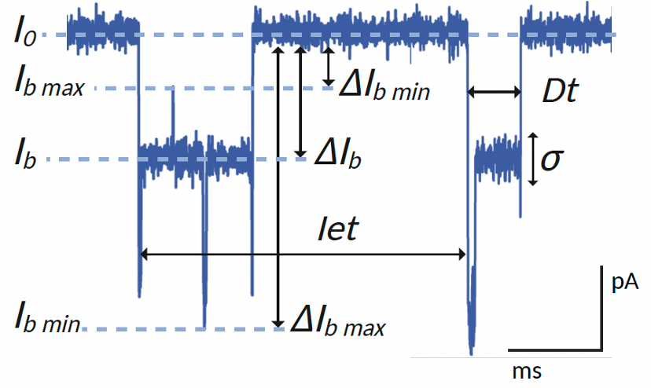

<section class="research-v13-hero">

RESEARCH PROGRAMME

# Reading chemistry, structure and information at the single-molecule level

My research develops biological and solid-state nanopores as electrical observatories for proteins, peptides, disease biomarkers and sequence-defined polymers.

[Explore the research axes](#research-axes){.btn .btn-primary}
[Selected publications](publications.qmd){.btn .btn-outline-primary}

SINGLE-MOLECULE NANOPORE SCIENCE

How much molecular information can be extracted from one molecule?

Connecting pore architecture, molecular transport and quantitative ionic-current fingerprints.

TransportConformationIsomersPTMsSequence

</section>

<section class="v12-section research-v13-intro reveal">

SCIENTIFIC STRATEGY

<h2>From nanopore transport to molecular interpretation</h2>

A nanopore experiment is not only a detection event. The amplitude, duration, fluctuations and population structure of an electrical signal report on molecular charge, shape, conformation, dynamics and interactions with the pore. My programme connects these observables to chemically meaningful questions.

</section>

<section class="v12-section" id="research-axes">

RESEARCH AXES
<h2>Four connected directions</h2>

<article class="research-v46-card reveal">

01BIOLOGICAL NANOPORES

<h3>Engineering aerolysin as a molecular reader</h3>

Aerolysin is engineered as a highly sensitive electrical reader of proteins and peptides. Pore architecture, internal charge and electrolyte conditions are tuned to control capture, transport and signal resolution.

Engineered constrictionsElectro-osmotic flowTransport dynamics

<strong>Representative papers</strong><a href="https://doi.org/10.1021/acsnano.5c08031">ACS Nano 2025</a><a href="https://doi.org/10.1039/D5SC01156F">Chemical Science 2025</a><a href="https://doi.org/10.1021/acssensors.8b01636">ACS Sensors 2019</a>

</article>

<article class="research-v46-card reveal">

02SOLID-STATE NANOPORES

<h3>Transport and sensing in complex environments</h3>

Solid-state nanopores provide robust platforms for studying confined molecular transport and detecting biomarkers in demanding media. Controlled polymer environments and data analysis extend sensing toward serum-containing samples.

Confined transportPEG crowdingMachine learning

<strong>Representative papers</strong><a href="https://doi.org/10.1038/s41467-026-68912-4">Nature Communications 2026</a><a href="https://doi.org/10.1021/acsnano.3c08433">ACS Nano 2023</a><a href="https://doi.org/10.1021/nn301672g">ACS Nano 2012</a>

</article>

<article class="research-v46-card reveal">

03DISEASE BIOMARKERS

<h3>Resolving clinically relevant molecular variants</h3>

Nanopore fingerprints distinguish closely related biomarkers through differences in terminal residues, stereochemistry, conformation or post-translational modification, including measurements in complex biological matrices.

Peptide isomersConformations & PTMsSerum analysis

<strong>Representative papers</strong><a href="https://doi.org/10.1021/acscentsci.4c00020">ACS Central Science 2024</a><a href="https://doi.org/10.1021/acscentsci.2c01256">ACS Central Science 2023</a><a href="https://doi.org/10.1038/s41467-025-58509-8">Nature Communications 2025</a>

</article>

<article class="research-v46-card reveal">

04EMERGING APPLICATIONS

<h3>Reading molecular information and reactive species</h3>

Nanopore sensing is extended beyond conventional biomolecules toward sequence-defined digital polymers and reactive polysulfides involved in lithium–sulfur battery chemistry.

<strong>Digital polymers</strong>Transport control, engineered sensing regions and consensus-based decoding.<small>PEPR MolecularXiv</small>

<strong>Energy chemistry</strong>Single-molecule identification of polysulfides and reaction intermediates.<small>PEPR SENSIGA Batteries</small>

<strong>Representative paper</strong><a href="https://doi.org/10.1038/s43246-020-00056-4">Communications Materials 2020</a>

</article>

</section>

<section class="v12-section research-visuals-v18">

NANOPORE READOUT
<h2>From pore structure to electrical fingerprint</h2>

<figure class="research-visual-card-v18 reveal current-trace-card-v18">

<figcaption><strong>Single-molecule ionic-current signatures.</strong> Blockade depth, dwell time and event fluctuations provide complementary descriptors of molecular identity, conformation and dynamics.</figcaption>
</figure>
<figure class="research-visual-card-v18 reveal aerolysin-card-v18">

<figcaption><strong>Aerolysin nanopore architecture.</strong> Rotating view of the pore used as a single-molecule sensing element. Animation: Nano1FB, PDB 9FM6, <a href="https://commons.wikimedia.org/wiki/File:Aerolysin_gif.gif?uselang=fr">CC BY-SA 4.0</a>.</figcaption>
</figure>

</section>

<section class="v12-section research-v13-framework">

EXPERIMENTAL LOGIC
<h2>A complete chain from molecule to interpretation</h2>

<strong>1</strong><h3>Design the sensing environment</h3>
Pore, membrane, electrolyte, voltage and molecular conditions.

<strong>2</strong><h3>Control molecular transport</h3>
Capture, orientation, translocation, confinement and interactions.

<strong>3</strong><h3>Extract electrical fingerprints</h3>
Blockade depth, dwell time, fluctuations and event populations.

<strong>4</strong><h3>Resolve molecular identity</h3>
Chemical variants, conformers, biomarkers and encoded sequences.

</section>

<section class="v12-section">

SELECTED MILESTONES
<h2>Scientific progression</h2>
<a href="publications.qmd">View publications →</a>

2012–2015<h3>Protein transport through protein and solid-state nanopores</h3>
Establishing a mechanistic foundation for confined protein transport and nanopore sensing.

2018<h3>Biological adapters for solid-state nanopores</h3>
Thermostable viral portal proteins developed as programmable sensing elements.

2024<h3>Peptide stereochemistry at the single-molecule level</h3>
Nanopore discrimination of a peptide biomarker and its enantiomer.

2025<h3>Conformational and isomeric resolution</h3>
Electrical identification of subtle peptide states, including proline cis/trans isomers.

Current<h3>Complex samples and molecular decoding</h3>
Advancing biomarker detection in realistic matrices and reading information encoded in synthetic polymers.

</section>

<section class="v12-section research-v13-methods">

CAPABILITIES
<h2>Experimental and analytical expertise</h2>

∿<h3>Electrophysiology</h3>
Low-noise ionic-current acquisition and event-level analysis.

◫<h3>Protein nanopores</h3>
Aerolysin sensing, transport control and pore engineering.

⬡<h3>Solid-state nanopores</h3>
Transport in confined media and complex samples.

◎<h3>Biomarker analysis</h3>
Proteins, peptides, isomers and post-translational modifications.

▥<h3>Data analysis</h3>
Multidimensional fingerprints, classification and machine learning.

⌁<h3>Molecular design</h3>
Connecting chemistry, conformation and nanopore readout.

</section>

<section class="v12-section v12-closing reveal">

COLLABORATION
<h2>Advancing nanopore science across disciplines</h2>
Potential collaborations are especially relevant in peptide and protein chemistry, biomarker analysis, sequence-defined polymers, molecular modelling and energy materials.

[Contact](contact.qmd){.btn .btn-primary}[Funding & innovation](funding-collaborations.qmd){.btn .btn-outline-light}

</section>

