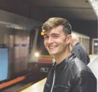
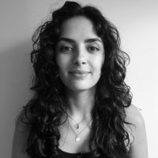

```{=html}
<div class="team-v35-page">

<section class="team-v35-hero">
  <div class="team-v35-inner">
    <span class="research-v8-kicker">TEAM</span>
    <h1>People behind the science</h1>
    <p class="team-v35-lead">A collaborative research environment dedicated to single-molecule nanopore sensing, peptide and protein biomarkers, and molecular transport.</p>
  </div>
</section>

<section class="team-v35-section team-v35-pi-section">
  <div class="team-v35-inner">
    <div class="team-v35-pi-card">
      <div class="team-v35-pi-photo">
        
      </div>
      <div class="team-v35-pi-content">
        <span class="team-v35-eyebrow">PRINCIPAL INVESTIGATOR</span>
        <h2>Dr. Benjamin Cressiot, HDR</h2>
        <p class="team-v35-role">Associate Professor of Biochemistry and Molecular Biology</p>
        <p>Benjamin Cressiot develops biological and solid-state nanopore approaches for the single-molecule analysis of proteins, peptides and disease biomarkers. His research focuses on molecular discrimination, conformational heterogeneity, post-translational modifications and sensing in complex biological media.</p>
        <div class="team-v35-links">
          <a href="https://scholar.google.com/citations?user=j6joo1gAAAAJ&amp;hl=en" target="_blank" rel="noopener">Google Scholar</a>
          <a href="https://orcid.org/0000-0001-9319-3152" target="_blank" rel="noopener">ORCID</a>
          <a href="https://fr.linkedin.com/in/benjamin-cressiot-1a53a887" target="_blank" rel="noopener">LinkedIn</a>
          <a href="mailto:benjamin.cressiot@cyu.fr">Email</a>
        </div>
      </div>
    </div>
  </div>
</section>

<section class="team-v35-section team-v35-current">
  <div class="team-v35-inner">
    <span class="team-v35-section-label">CURRENT MEMBERS</span>
    <h2>Current researchers</h2>

    <div class="team-v35-grid team-v35-grid-current">
      <article class="team-v35-card">
        <div class="team-v35-avatar">
          
        </div>
        <div class="team-v35-card-body">
          <span class="team-v35-status">Postdoctoral researcher · since October 2025</span>
          <h3>Soching LUIKHAM</h3>
          <p>Detection and reading of synthetic polymers for molecular information storage using nanopores.</p>
          <a class="team-v37-linkedin" href="https://in.linkedin.com/in/soching-luikham-02474612a" target="_blank" rel="noopener">LinkedIn</a>
        </div>
      </article>

      <article class="team-v35-card">
        <div class="team-v35-avatar">
          
        </div>
        <div class="team-v35-card-body">
          <span class="team-v35-status">PhD candidate · since January 2024</span>
          <h3>Luca Iesu</h3>
          <p>Detection and quantification of peptide biomarkers using hybrid nanopore systems.</p>
          <p class="team-v35-meta">Co-supervised with Prof. Juan Pelta</p>
          <a class="team-v37-linkedin" href="https://www.linkedin.com/in/luca-iesu-2851291a2/" target="_blank" rel="noopener">LinkedIn</a>
        </div>
      </article>

      <article class="team-v35-card">
        <div class="team-v35-avatar">
          
        </div>
        <div class="team-v35-card-body">
          <span class="team-v35-status">PhD candidate · since October 2023</span>
          <h3>Laura Ratinho</h3>
          <p>Electrical detection of protein biomarkers in biological fluids using nanopores.</p>
          <p class="team-v35-meta">Co-supervised with Prof. Juan Pelta</p>
          <a class="team-v37-linkedin" href="https://www.linkedin.com/in/laura-ratinho-a1b038197/" target="_blank" rel="noopener">LinkedIn</a>
        </div>
      </article>
    </div>
  </div>
</section>

<section class="team-v35-section team-v35-master">
  <div class="team-v35-inner">
    <span class="team-v35-section-label">MASTER STUDENTS (2026)</span>
    <div class="team-v35-grid team-v35-grid-master">
      <article class="team-v35-mini-card"><strong>Mélanie De Magalhaes</strong><p>Master 1 internship (2026)</p></article>
      <article class="team-v35-mini-card"><strong>Kalifa Sidibé</strong><p>Master 1 internship (2026)</p></article>
      <article class="team-v35-mini-card"><strong>Ilies Hakimi</strong><p>Master 1 internship (2026)</p></article>
    </div>
  </div>
</section>

<section class="team-v35-section team-v35-alumni">
  <div class="team-v35-inner">
    <span class="team-v35-section-label">ALUMNI &amp; PREVIOUS SUPERVISION</span>
    <h2>Former researchers and students</h2>

    <div class="team-v35-grid team-v35-grid-alumni">
      <article class="team-v35-mini-card"><span class="team-v35-year">2023–present</span><h3>Laura Ratinho</h3><p><strong>PhD candidate</strong></p><p>Electrical detection of protein biomarkers in biological fluids using nanopores.</p><p class="team-v35-mini-links"><a href="https://www.linkedin.com/in/laura-ratinho-a1b038197/" target="_blank" rel="noopener noreferrer"><i class="bi bi-linkedin"></i> LinkedIn</a></p></article>

      <article class="team-v35-mini-card"><span class="team-v35-year">2023–2024</span><h3>Dr. Nathan Meyer</h3><p><strong>Postdoctoral researcher</strong></p><p>Discrimination of oxytocin and its structural variants by nanopore.</p></article>

      <article class="team-v35-mini-card"><span class="team-v35-year">2022</span><h3>Laura Ratinho</h3><p><strong>Master 2</strong></p><p>Dynamics and conformations of peptides through an aerolysin nanopore.</p><p class="team-v35-mini-links"><a href="https://www.linkedin.com/in/laura-ratinho-a1b038197/" target="_blank" rel="noopener noreferrer"><i class="bi bi-linkedin"></i> LinkedIn</a></p></article>

      <article class="team-v35-mini-card"><span class="team-v35-year">2022</span><h3>Aïcha Stierlen</h3><p><strong>Master 2</strong></p><p>Coagulation biomarker derivatives and post-translational modification.</p><p class="team-v35-mini-links"><a href="https://www.linkedin.com/in/aicha-stierlen-0016bb226/" target="_blank" rel="noopener noreferrer"><i class="bi bi-linkedin"></i> LinkedIn</a></p></article>

      <article class="team-v35-mini-card"><span class="team-v35-year">2022</span><h3>Habibullah Moradian</h3><p><strong>Master 2</strong></p><p>Detection of a biomarker peptide by nanopore.</p><p class="team-v35-mini-links"><a href="https://www.linkedin.com/in/habibullahmoradian/" target="_blank" rel="noopener noreferrer"><i class="bi bi-linkedin"></i> LinkedIn</a></p></article>

      <article class="team-v35-mini-card"><span class="team-v35-year">2021</span><h3>Doryan Masmoudi</h3><p><strong>Master 1</strong></p><p>Detection of a hormonal biomarker peptide by nanopore.</p><p class="team-v35-mini-links"><a href="https://www.linkedin.com/in/doryan-masmoudi-43b50418a/" target="_blank" rel="noopener noreferrer"><i class="bi bi-linkedin"></i> LinkedIn</a></p></article>

      <article class="team-v35-mini-card"><span class="team-v35-year">2020</span><h3>Laura Ratinho</h3><p><strong>Licence 3 internship student</strong></p><p>Dynamics and conformations of peptides through an aerolysin nanopore.</p><p class="team-v35-mini-links"><a href="https://www.linkedin.com/in/laura-ratinho-a1b038197/" target="_blank" rel="noopener noreferrer"><i class="bi bi-linkedin"></i> LinkedIn</a></p></article>

      <article class="team-v35-mini-card"><span class="team-v35-year">2020</span><h3>Dorian Velon</h3><p><strong>Licence 2 internship student</strong></p><p>Dynamics and conformations of peptides through an aerolysin nanopore.</p><p class="team-v35-mini-links"><a href="https://www.linkedin.com/in/dorian-velon/" target="_blank" rel="noopener noreferrer"><i class="bi bi-linkedin"></i> LinkedIn</a></p></article>
    </div>
  </div>
</section>

<section class="team-v35-join">
  <div class="team-v35-inner">
    <div class="team-v35-join-card">
      <div>
        <span class="team-v35-section-label">JOIN THE RESEARCH</span>
        <h2>Prospective students and collaborators</h2>
        <p>Enquiries from motivated students and researchers interested in nanopore sensing, biomarker analysis and single-molecule biophysics are welcome.</p>
      </div>
      <a class="team-v35-contact-button" href="contact.qmd">Get in touch</a>
    </div>
  </div>
</section>

</div>
```
